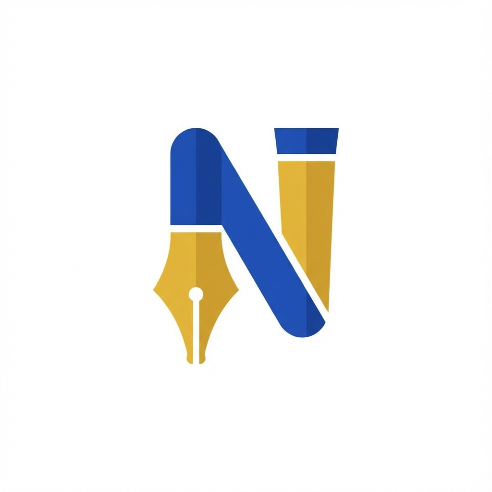

# Nabu 🖋️

**Nabu** (formerly Meeting Summarizer) is an intelligent local meeting assistant that records, transcribes, and summarizes your meetings automatically.

Named after the Mesopotamian god of literacy, scribes, and wisdom, Nabu acts as your personal digital scribe, ensuring you never miss a detail.



## Features

-   **Automatic Meeting Detection**: Monitors microphone and system audio to detect when a meeting starts.
-   **Dual-Channel Recording**: Captures both your voice (Microphone) and remote participants (System Audio/Loopback).
-   **AI Summarization**: Uses Google Gemini to generate concise summaries, titles, and tags.
-   **Local Database**: Stores all meeting history locally with SQLite.
-   **Modern UI**: A premium, dark-mode interface with a "Royal Blue & Gold" theme.
-   **Privacy First**: Recordings and database are stored locally on your machine.

## Installation

1.  **Clone the repository**:
    ```bash
    git clone https://github.com/ishayw/Nabu.git
    cd Nabu
    ```

2.  **Install dependencies**:
    ```bash
    pip install -r requirements.txt
    ```
    *Note: You may need to install [FFmpeg](https://ffmpeg.org/download.html) and add it to your PATH for audio processing.*

3.  **Set up Environment Variables**:
    Create a `.env` file in the root directory and add your Google Gemini API key:
    ```env
    GEMINI_API_KEY=your_api_key_here
    ```

## Usage

1.  **Run the application**:
    ```bash
    python main.py
    ```

2.  **Open the interface**:
    Navigate to `http://localhost:8000` in your browser.

3.  **Start a Meeting**:
    -   **Automatic**: Join a Google Meet, Zoom, or Teams call. Nabu will detect the audio and start recording.
    -   **Manual**: Click the "Record" button in the UI.

4.  **View Summaries**:
    Once the meeting ends (or you click Stop), Nabu will process the audio and display the summary, title, and tags in the history list.

## Tech Stack

-   **Backend**: Python, FastAPI
-   **Frontend**: HTML, Vanilla JS, Tailwind CSS
-   **Audio**: SoundDevice, SoundFile, NumPy
-   **AI**: Google Gemini Pro
-   **Database**: SQLite

## License

[MIT](LICENSE)
